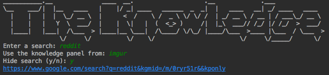

# the_knowledge [Archive]

This specific vulnerability has been fixed by google. This project is now effectively useless.

Proof of concept code to exploit quirk in how google renders knowledge panels.
Concept from https://wietzebeukema.nl/blog/spoofing-google-search-results

##### Example run:

Dependencies are listed in requirements.txt.
Program needs gecko driver for selenium too.

